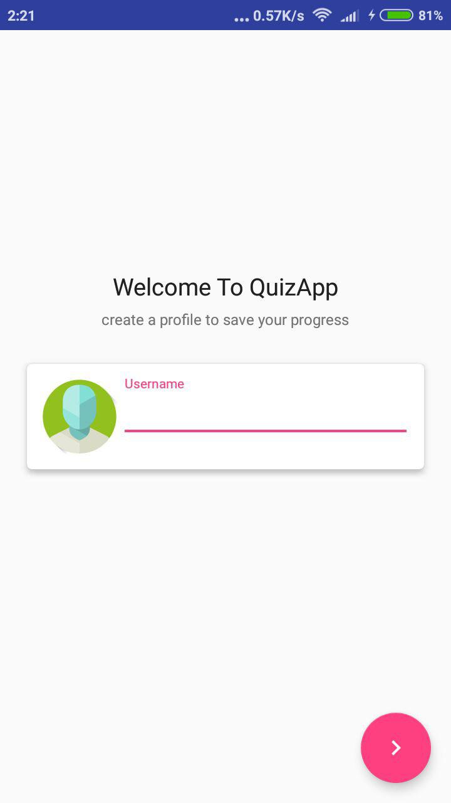
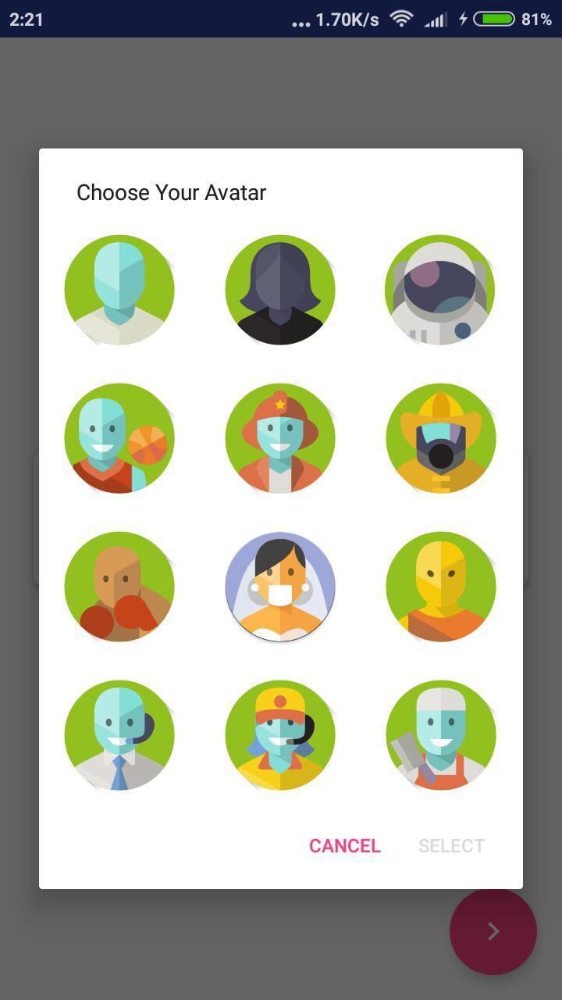
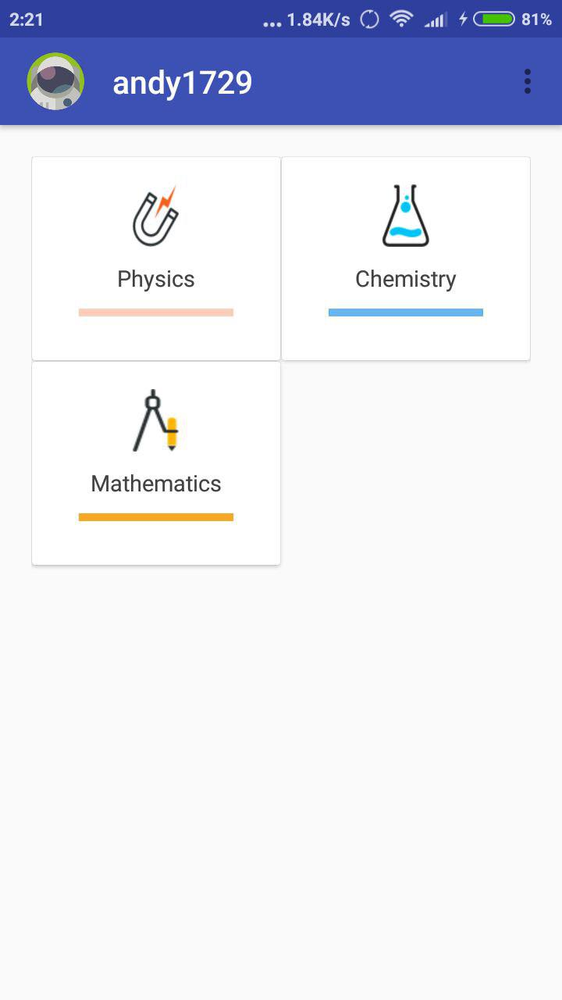
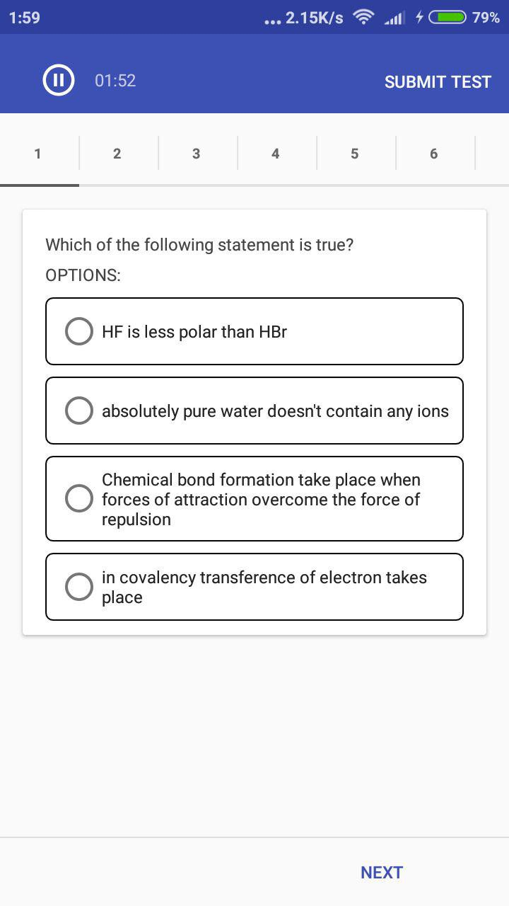

# QuizApp  

Play Quiz in Android

 

## Task List For Maintainers And Contributors.
- [x] Create Quiz UI.
- [x] Create timer.
- [x] Create QuizSubmit Function.
- [ ] Create Rsult UI.
- [ ] Let user create their own Quiz by importing json file.

## Install
Coming soon on Google Play Store

## Contributing

Please read [CONTRIBUTING.md](https://github.com/andy1729/QuizApp/blob/master/CONTRIBUTING.md) for details on code of conduct, and the process for submitting pull requests.

## Author

* **Ujjawal Anand** - [*andy1729*](https://andy1729.github.io)

## License

This project is licensed under the MIT License - see the [LICENSE.md](LICENSE.md) file for details
